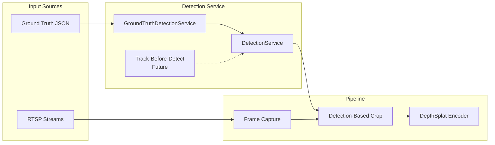

# DepthSplat Inference Pipeline Summary

This document provides a comprehensive overview of the real-time inference pipeline for DepthSplat.

## 1. Overview

The DepthSplat inference pipeline is designed to ingest multiple synchronized RTSP video streams, process them using the DepthSplat model, and output 3D Gaussian Splats in real-time. It is built using PyTorch and OpenCV, capable of running in a development mode (with a stream simulator) or production mode (with valid camera streams).

## 2. Architecture

The pipeline consists of the following stages:

1.  **Input Acquisition**: Captures video frames from multiple RTSP sources using OpenCV (supporting GStreamer and FFmpeg backends).
2.  **Preprocessing**: Resizes, normalizes, and batches images into PyTorch tensors.
3.  **Inference**: Runs the DepthSplat encoder to generate 3D Gaussian parameters (positions, covariances, colors, opacities).
4.  **Post-Processing & Output**: formats the output and makes it available via callbacks or a queue for downstream consumption (e.g., visualization or transmission).
5.  **Monitoring**: Tracks performance (FPS, latency) and exposes Prometheus metrics.

## 3. Key Components

### 3.1 Entry Point (`main.py`)
- **Role**: Orchestrates the pipeline lifecycle.
- **Responsibilities**:
    - Loads configuration (`config/pipeline_config.yaml`).
    - Sets up logging and the Metrics Server (`utils/metrics.py`).
    - Initializes and starts the `DepthSplatPipeline`.
    - Handles graceful shutdown via signal handlers (SIGINT/SIGTERM).

### 3.2 Configuration (`config/__init__.py`)
- **Role**: centralized configuration management.
- **Implementation**: Uses Python `dataclasses` for type-safe configuration.
- **Features**:
    - Loads from YAML files.
    - Supports environment variable expansion (e.g., `${VAR:default}`).
    - Configures sources, model parameters, deepstream settings (legacy naming), and monitoring.

### 3.3 Pipeline Logic (`pipeline/deepstream_pipeline.py`)
- **Role**: The core processing engine.
- **Class**: `DepthSplatPipeline`
- **Workflow**:
    - **Initialization**: Connects to RTSP streams and loads the PyTorch model.
    - **Capture**: Reads frames from all camera sources in a loop.
    - **Preprocessing**: 
        - Resizes frames to model input size (default 256x256).
        - Converts BGR to RGB.
        - Normalizes to [0, 1] and applies ImageNet mean/std.
        - Stacks into a batch tensor `[1, V, 3, H, W]`.
    - **Inference**:
        - Constructs context (images + intrinsics/extrinsics) using calibration data from `drone_camera_observations.json`.
        - Intrinsics are normalized based on the crop region to account for detection-based cropping.
        - Calls the model's encoder.
    - **Output**: packages results into `GaussianOutput` data class containing:
        - `positions` (XYZ)
        - `covariances`
        - `colors` (RGB/SH)
        - `opacities`

### 3.4 Model Wrapper (`model/depthsplat_wrapper.py`)
- **Role**: Interface between the pipeline and the training code.
- **Class**: `DepthSplatWrapper`
- **Responsibilities**:
    - Loads the complex training checkpoint (LightningModule + Hydra config).
    - Extracts the relevant Encoder and Decoder components.
    - Provides a clean `forward()` interface returning standard PyTorch tensors or dictionaries.

## 4. Data Flow

```mermaid
graph LR
    RTSP[RTSP Streams] --> |OpenCV| Capture[Capture & Sync]
    Capture --> |Raw Frames| Preprocess[Resize & Normalize]
    Preprocess --> |Tensor [B,V,C,H,W]| Model[DepthSplat Encoder]
    Model --> |Latents| Gaussians[Gaussian Parameters]
    Gaussians --> |GaussianOutput| OutputQueue[Output Queue]
    OutputQueue --> Callback[Consumer Callback]
```

## 5. Usage

### Development Mode
Uses the built-in RTSP stream simulator.
```bash
python main.py --config config/pipeline_config.yaml --mode dev
```

### Production Mode
Connects to real cameras defined in the config.
```bash
python main.py --config config/pipeline_config.yaml --mode prod
```

### Configuration
Edit `config/pipeline_config.yaml` to adjust:
- **Sources**: RTSP URLs.
- **Model**: Checkpoint path, input resolution.
- **Monitoring**: Logging levels, metrics port.

## 6. Visualization System

The visualization system provides a real-time web-based frontend for monitoring the inference pipeline.

### 6.1 Architecture

```
┌─────────────────────────────────────────────────────────────────┐
│                        BACKEND (Python)                         │
├─────────────────────────────────────────────────────────────────┤
│  RTSP Streams → Preprocessor → Encoder → Decoder → JPEG Encode  │
│                                    ↓                            │
│                          WebSocket Broadcast                    │
│            (input thumbnails, cropped ROI, rendered 3DGS)       │
└────────────────────────────┬────────────────────────────────────┘
                             │ WebSocket (JSON + base64 images)
                             ▼
┌─────────────────────────────────────────────────────────────────┐
│                      FRONTEND (Browser)                         │
├─────────────────────────────────────────────────────────────────┤
│  ┌───────────┐  ┌──────────────┐  ┌─────────────────────────┐  │
│  │  5 Input  │  │   Cropped    │  │     3DGS Render         │  │
│  │   Feeds   │  │   Object     │  │   + View Controls       │  │
│  │           │  │              │  │   + Stats Overlay       │  │
│  └───────────┘  └──────────────┘  └─────────────────────────┘  │
│  ┌──────────────────────────────────────────────────────────┐  │
│  │      Stats Bar: FPS, Latency, Gaussian Count, etc.       │  │
│  └──────────────────────────────────────────────────────────┘  │
└─────────────────────────────────────────────────────────────────┘
```

### 6.2 Key Components

#### WebSocket Server (`server/websocket_server.py`)
- **Class**: `VisualizationServer`
- **Features**:
  - Accepts client connections
  - Broadcasts frame packets to all connected clients
  - Handles view mode control messages
  - Manages render camera animation (orbit mode)

#### Visualization Pipeline (`pipeline/visualization_pipeline.py`)
- **Class**: `VisualizationPipeline`
- **Extends**: `DepthSplatPipeline`
- **Additions**:
  - Server-side Gaussian rendering using the decoder
  - WebSocket streaming to connected clients
  - Render camera management (orbit, preset views)

#### Frontend (`frontend/`)
- **Technology**: Vanilla HTML/JS with Tailwind CSS (CDN)
- **Files**:
  - `index.html`: Three-column layout with stats display
  - `app.js`: WebSocket client with reconnection logic

### 6.3 Frame Packet Structure

Each WebSocket message contains:
```json
{
  "type": "frame",
  "timestamp": 1234567890123,
  "frame_id": 42,
  "inputs": ["<base64_jpeg>", ...],
  "cropped": "<base64_jpeg>",
  "gaussian_render": "<base64_jpeg>",
  "stats": {
    "num_gaussians": 65536,
    "encoder_ms": 45.2,
    "decoder_ms": 12.3,
    "total_latency_ms": 62.5,
    "fps": 28.5
  }
}
```

### 6.4 View Modes

| Mode | Description |
|------|-------------|
| `orbit` | Slowly rotates around the object (default) |
| `front` | Fixed front-facing view |
| `top` | Fixed top-down view |
| `side` | Fixed side view |
| `input_match` | Matches one of the input camera viewpoints |

### 6.5 Usage

#### Start Visualization Server
```bash
# Default (dev mode)
./scripts/start_visualization.sh

# Production mode
./scripts/start_visualization.sh prod

# Custom ports
WS_PORT=9000 HTTP_PORT=8000 ./scripts/start_visualization.sh
```

#### Direct Python
```bash
python main_visualization.py --config config/pipeline_config.yaml
```

#### Access URLs
- **Frontend**: http://localhost:8080
- **WebSocket**: ws://localhost:8765

### 6.6 Configuration

Add to `config/pipeline_config.yaml`:
```yaml
visualization:
  enabled: true
  websocket:
    host: "0.0.0.0"
    port: 8765
  render:
    width: 512
    height: 512
    jpeg_quality: 85
  thumbnails:
    width: 192
    height: 108
  view:
    default_mode: "orbit"
    orbit_speed_deg_per_sec: 15.0
  detection:
    enabled: true
    gt_path: "/path/to/drone_camera_observations.json"
    crop_size: 256
```

## 7. Detection Service

The detection service provides 2D object detection coordinates for each camera view, enabling accurate cropping of the region of interest (the flying object) for both model input and visualization.

### 7.1 Architecture



### 7.2 Key Components

#### Detection Service Classes (`services/`)

| Class | Role |
|-------|------|
| `Detection` | Single object detection with center, visibility, confidence, bbox |
| `FrameDetections` | Per-frame detections for all cameras |
| `DetectionService` | Abstract base class defining the interface |
| `GroundTruthDetectionService` | Reads pre-computed detections from Isaac Sim JSON |

#### Detection Data Structure

```python
@dataclass
class Detection:
    center_2d: Tuple[float, float]  # (x, y) pixel coordinates
    visible: bool                    # Object visible in this view
    confidence: float                # 0-1 confidence score
    bbox: Optional[Tuple[float, ...]] # (x_min, y_min, x_max, y_max)
    depth: Optional[float]           # Depth in meters
    object_id: Optional[str]         # For tracking
```

### 7.3 Ground Truth Service

For development, the `GroundTruthDetectionService` reads 2D object positions from Isaac Sim render exports:

**Input JSON Structure** (`drone_camera_observations.json`):
```json
{
  "metadata": { "num_frames": 120, ... },
  "cameras": [...],
  "frames": [
    {
      "frame_index": 0,
      "cameras": [
        {
          "name": "cam_01",
          "drone_center_2d": [1278.8, 835.3],
          "visible": true,
          "depth": 50.2,
          "bbox_2d": {"x_min": 1250, "y_min": 810, "x_max": 1310, "y_max": 865}
        },
        ...
      ]
    },
    ...
  ]
}
```

### 7.4 Detection-Based Cropping

The pipeline uses detection coordinates to crop around the flying object:

1. **Model Input**: `_preprocess_frames_with_detections()` crops each camera view centered on the detected object position before feeding to the encoder.

2. **Visualization Thumbnails**: `_create_cropped_views()` creates cropped previews showing the object of interest for the frontend.

3. **Fallback**: If no detection is available, reverts to center cropping.

```python
# Crop region calculation (simplified)
x1, y1, x2, y2 = detection.get_crop_region(
    crop_size=256,           # Desired crop size
    image_width=frame_w,
    image_height=frame_h,
    use_bbox=True            # Use bbox for sizing if available
)
cropped = frame[y1:y2, x1:x2]
```

### 7.5 Future: Track-Before-Detect

In production, the ground truth service will be replaced by a **track-before-detect** service that:
- Processes raw RGB input streams
- Detects and tracks the flying object in real-time
- Outputs 2D center coordinates per camera view per frame

The service interface is designed to make this swap seamless—simply implement `DetectionService.get_detections()` with a different backend.

### 7.6 Configuration

```yaml
visualization:
  detection:
    enabled: true
    gt_path: "/path/to/drone_camera_observations.json"
    crop_size: 256  # Pixels, size of cropped region
```

## 8. Performance

### Current Benchmarks (RTX 3090)

| Metric | Value |
|--------|-------|
| Inference FPS | ~5.2 |
| Encoder Latency | ~68ms |
| Decoder (Render) | ~2.7ms |
| Total Latency | ~71ms |
| Gaussians per Frame | 327,680 |

### Bottlenecks

1. **Encoder inference** dominates latency (~95%)
2. **RTSP capture** adds minimal overhead with OpenCV
3. **WebSocket streaming** handles base64 encoding efficiently

## 9. Directory Structure

```
inference/
├── config/
│   └── pipeline_config.yaml      # Unified configuration
├── frontend/
│   ├── index.html                # Web UI
│   └── app.js                    # WebSocket client (if separate)
├── model/
│   └── depthsplat_wrapper.py     # Model loading utility
├── pipeline/
│   ├── deepstream_pipeline.py    # Core pipeline
│   └── visualization_pipeline.py # Extended with viz + detection
├── server/
│   └── websocket_server.py       # WebSocket broadcaster
├── services/
│   ├── detection_service.py      # Abstract detection interface
│   └── gt_detection_service.py   # Ground truth implementation
├── stream_simulator/
│   └── rtsp_server.py            # Development RTSP simulator
├── utils/
│   ├── logging_utils.py
│   └── metrics.py
├── main.py                       # Standard entry point
└── main_visualization.py         # Visualization entry point
```

